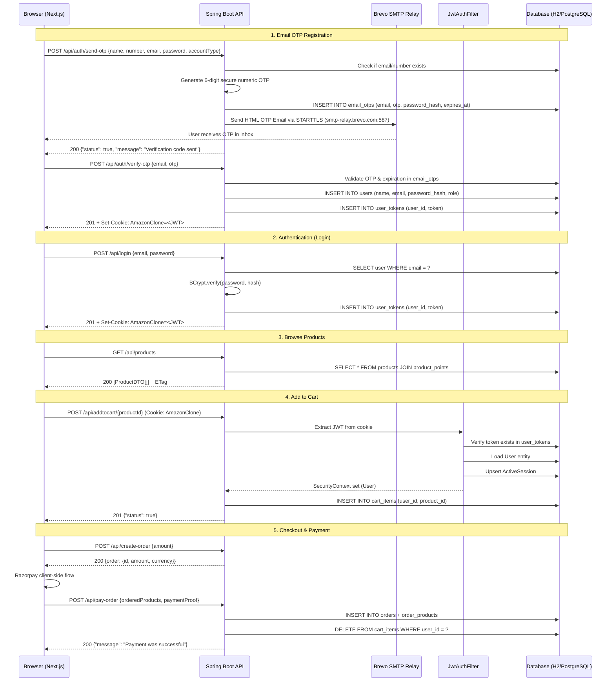
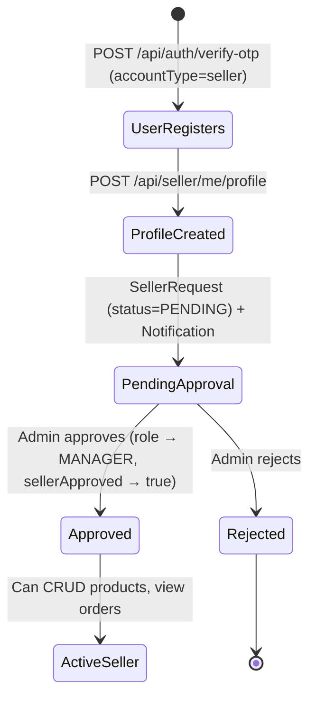

# Trade Hive — High-Level Design Document

---

## 1. Project Overview

Trade Hive is a production-grade, full-stack e-commerce platform that replicates the core storefront, seller marketplace, and administrative operations of a large-scale online retailer. The system is composed of a **Next.js 14** (App Router) client-side application and a **Spring Boot 3** RESTful backend, communicating over a stateless JSON API secured by JWT-based cookie authentication.

Its core value proposition is a complete three-persona experience — **Customer**, **Seller**, and **Admin** — in a single deployable codebase, with role-based access control, an integrated payment flow (Razorpay), real-time admin monitoring (Spring Boot Admin / Actuator), and a product-seeding mechanism that enables zero-configuration local development.

---

## 2. System Architecture

### 2.1 Architectural Pattern

The project follows a **layered, client–server monolith** pattern with a clear separation between the presentation tier (Next.js) and the application/data tier (Spring Boot). Within the backend, the codebase adheres to a **Service-Oriented Layered Architecture** (often called a "clean MVC" variant):

| Layer | Responsibility | Spring Boot Package |
|---|---|---|
| **Controller** | HTTP request/response mapping, validation, auth extraction | `controller/` |
| **Service** | Business logic, transaction orchestration, cross-concern coordination | `service/` |
| **Repository** | Data access via Spring Data JPA interfaces | `repository/` |
| **Entity** | Persistent domain model mapped to relational tables | `entity/` |
| **DTO** | API contract objects decoupled from JPA entities | `dto/` |
| **Security** | JWT filter chain, Spring Security configuration, password encoding | `security/` |
| **Config** | Data seeding, caching filters, schema migration, diagnostics | `config/` |

On the frontend, the architecture is **component-driven** with centralised state managed through React Context providers. Page-level routing is handled by the Next.js App Router (`app/` directory), and all backend communication is funnelled through a single API gateway module (`lib/api.ts`).

### 2.2 Deployment Topology

```
┌──────────────────────────┐       HTTP (JSON)       ┌──────────────────────────┐
│   Next.js Frontend       │ ───────────────────────▶ │   Spring Boot Backend    │
│   (localhost:3000)       │ ◀─────────────────────── │   (localhost:8081)       │
│                          │    Set-Cookie (JWT)      │                          │
│  ┌─────────────────────┐ │                          │  ┌─────────────────────┐ │
│  │ App Router (SSR/CSR)│ │                          │  │ SecurityFilterChain │ │
│  │ Context Providers   │ │                          │  │ JwtAuthFilter       │ │
│  │ lib/api.ts gateway  │ │                          │  │ REST Controllers    │ │
│  └─────────────────────┘ │                          │  │ Service Layer       │ │
│                          │                          │  │ JPA Repositories    │ │
│  Rewrite proxy:          │       HTTP               │  └─────────────────────┘ │
│  /sba/** ──────────────────────────────────────────▶│                          │
│  /actuator/** ─────────────────────────────────────▶│  ┌─────────────────────┐ │
│                          │                          │  │ H2 / PostgreSQL     │ │
└──────────────────────────┘                          │  │ (JDBC)              │ │
                                                      │  └─────────────────────┘ │
                                                      │                          │
                                                      │  Spring Boot Admin UI    │
                                                      │  (embedded at /sba)      │
                                                      └──────────────────────────┘
```

- **Local development** uses H2 (file-based) with automatic schema management via `ddl-auto=update`.
- **Production** pivots to PostgreSQL (e.g., Neon) through environment variables (`DB_URL`, `DB_DRIVER`, etc.).
- The Next.js `rewrites` in `next.config.ts` proxy `/sba/**`, `/instances/**`, and `/actuator/**` to the backend so the admin can access Spring Boot Admin from the same origin.

---

## 3. Core Component Breakdown

### 3.1 Backend Components

- **AuthController** (`controller/AuthController.java`)
  - Handles email OTP generation (`POST /api/auth/send-otp`), OTP verification & registration (`POST /api/auth/verify-otp`), and login (`POST /api/login`).
  - Delegates OTP generation, email dispatch, and user persistence to `UserService`; delegates JWT generation and persistence to `JwtService`.
  - On successful registration/login, sets an `HttpOnly` cookie named `AmazonClone` containing the JWT.

- **EmailService** (`service/EmailService.java`)
  - Handles transactional email delivery through **Brevo SMTP Relay** (`smtp-relay.brevo.com:587` with STARTTLS).
  - Composes modern, branded HTML verification templates containing secure 6-digit OTPs with 10-minute expiration.
  - Provides a seamless local development fallback logger when Brevo credentials are not yet specified.

- **UserController** (`controller/UserController.java`)
  - Serves `/api/getAuthUser` (returns the current authenticated user in a legacy-compatible DTO shape) and `/api/logout` (clears tokens and the cookie).
  - Provides `/api/profile/address` for user address/geolocation updates.

- **ProductController** (`controller/ProductController.java`)
  - Public endpoints: `/api/products` (list all, with optional `category`/`tag` filters) and `/api/product/{id}`.

- **CartController** (`controller/CartController.java`)
  - Authenticated endpoints for add (`POST /api/addtocart/{id}`), remove (`DELETE /api/delete/{id}`), and quantity update (`PATCH /api/update-qty/{id}`).

- **PaymentController** (`controller/PaymentController.java`)
  - `POST /api/create-order` — creates a Razorpay order (or a mock order in development).
  - `POST /api/pay-order` — records a completed payment, creates an `Order` entity with line items, and clears the user's cart.

- **SellerController** (`controller/SellerController.java`)
  - Seller onboarding: `POST /api/seller/request` (submit seller application), `POST /api/seller/me/profile` (create/update profile).
  - Seller product CRUD: `POST`, `PUT`, `DELETE` on `/api/seller/products`.
  - Seller analytics: `GET /api/seller/me/orders` returns orders that contain the seller's products.
  - Public storefront: `GET /api/seller/{id}/products` and `GET /api/seller/{id}/profile`.

- **AdminController** (`controller/AdminController.java`)
  - Seller management: list/approve/reject seller requests; list/remove approved sellers (cascading to their products and active carts).
  - Product oversight: delete any product from the marketplace.
  - Notifications: list and clear system event notifications.
  - Live users: count of users with active sessions in the last 5 minutes.

- **JwtService** (`service/JwtService.java`)
  - Generates HS256-signed JWTs with a configurable expiration (default 1 hour).
  - Persists tokens in a `user_tokens` table for server-side invalidation on logout.

- **JwtAuthenticationFilter** (`security/JwtAuthenticationFilter.java`)
  - A `OncePerRequestFilter` that extracts the JWT from the `AmazonClone` cookie, validates it, verifies the token exists in the database, loads the `User` entity, records an `ActiveSession`, and sets `SecurityContext`.

- **SecurityConfig** (`security/SecurityConfig.java`)
  - Defines two ordered `SecurityFilterChain` beans:
    1. **Order 1**: Spring Boot Admin/Actuator endpoints — HTTP Basic with `ADMIN` authority.
    2. **Order 2**: All API endpoints — stateless session, JWT filter, path-based authorisation rules.
  - Configures CORS for `localhost:3000` and provides a `BCryptPasswordEncoder` bean.

- **DataLoader** (`config/DataLoader.java`)
  - A `CommandLineRunner` that seeds 30 products on startup with configurable modes: `none`, `empty-only`, `missing` (default), and `replace`.

- **ResponseCachingConfig** (`config/ResponseCachingConfig.java`)
  - Registers a `ShallowEtagHeaderFilter` for conditional GET support (ETag / `If-None-Match`).
  - Applies `Cache-Control` headers: `public, max-age=30` for product listings, `private, max-age=30` for authenticated seller/admin endpoints.

### 3.2 Frontend Components

- **Context Providers** (`context/`)
  - `CartContext` — manages authentication state (`authUser`), cart state, and exposes `login`, `signup`, `logout`, `addToCart`, `removeFromCart`, `updateQuantity` actions. All mutations call the backend then refresh the auth user to resync cart state.
  - `FavoritesContext` — hybrid storage: uses `localStorage` for unauthenticated users and syncs to the server (`/api/me/favorites`) for authenticated users, with optimistic updates.
  - `HomeDataContext` — caches the product list for the home page.
  - `AdminDataContext` — caches admin dashboard metrics (live users, seller requests, notifications).
  - `SellerDataContext` — caches the seller's product list and profile.

- **API Gateway** (`lib/api.ts`)
  - A single `apiFetch<T>()` function wrapping the native `fetch` API with `credentials: "include"`, automatic JSON parsing, and unified error handling via a custom `ApiError` class.
  - All 30+ API functions are thin wrappers around `apiFetch`, providing type-safe DTOs.

- **Role Utilities** (`lib/role.ts`)
  - `normalizeRole()` — maps backend role strings (including legacy `ROLE_` prefixes, `SELLER` synonyms) to the canonical `AppRole` union type.
  - `getRoleLandingPath()` — returns the appropriate landing page per role: `/admin/dashboard`, `/seller/dashboard`, or `/`.

- **App Routes** (`app/`)
  - Customer-facing: `/` (home), `/shop`, `/product/[id]`, `/cart`, `/checkout`, `/favorites`, `/profile`, `/login`, `/signup`, `/contact`.
  - Seller: `/seller/dashboard` (with product CRUD, order analytics).
  - Admin: `/admin/dashboard`, `/admin/sellers`, `/admin/products`, `/admin/notifications`.

- **Reusable UI Components** (`components/`)
  - Organised by domain: `admin/`, `auth/`, `cart/`, `home/`, `layout/`, `product/`, `profile/`, `seller/`, `ui/`.
  - The `ui/` directory contains headless primitives (shadcn/ui-based) such as buttons, selects, separators, and cards.

---

## 4. Data Flow & Working Mechanism

### 4.1 Primary Flow: Product Purchase (End-to-End)

Below is a step-by-step walkthrough of a customer completing a purchase:

1. **Browse Products** — The frontend calls `GET /api/products`. The backend's `ProductController` queries the `ProductRepository`, joins `ProductPoint` entities, and returns a list of `ProductDTO` objects. Public cache headers (`max-age=30`) and ETag are applied.

2. **Authentication** — The customer submits credentials via `POST /api/login`. `AuthController` looks up the user by email, verifies the BCrypt-hashed password, generates a JWT via `JwtService`, persists the token in `user_tokens`, and responds with a `Set-Cookie: AmazonClone=<jwt>` header.

3. **Add to Cart** — The frontend calls `POST /api/addtocart/{productId}`. The `JwtAuthenticationFilter` extracts the JWT from the cookie, validates it, loads the `User`, and places it in the `SecurityContext`. `CartController` delegates to `CartService`, which creates a `CartItem` row linked to the user and product.

4. **View Cart** — The frontend calls `GET /api/getAuthUser`. The `CompatAuthUserService` returns the user with their cart items serialized in a legacy-compatible shape (nested `cartItem` objects with product details). The `CartContext` provider transforms this into local state.

5. **Initiate Checkout** — The frontend calls `POST /api/create-order` with the cart total. `PaymentController` returns a Razorpay order ID (or a mock ID in development).

6. **Complete Payment** — After the Razorpay client-side flow succeeds, the frontend calls `POST /api/pay-order` with the payment proof. `PaymentController` delegates to `OrderService.createOrder()`, which:
   - Creates an `Order` entity linked to the user.
   - Creates `OrderProduct` entities for each line item (capturing price-at-time).
   - Clears the user's cart via `CartService.clearCart()`.
   - Persists everything in a single `@Transactional` boundary.

7. **View Order History** — The customer navigates to their profile. The frontend calls `GET /api/getAuthUser`, which includes order history via the `CompatAuthUserService`.

### 4.2 Mermaid Sequence Diagram



### 4.3 Seller Onboarding Flow



---

## 5. Tech Stack & Justification

| Layer | Technology | Version | Justification |
|---|---|---|---|
| **Frontend Framework** | Next.js (App Router) | 16.x | Server-side rendering for SEO, file-based routing for rapid page scaffolding, and React Server Components for optimal client bundle sizes. |
| **UI Styling** | Tailwind CSS + shadcn/ui | 4.x | Utility-first CSS eliminates style collisions in a component-heavy SPA; shadcn/ui provides accessible, headless primitives. |
| **State Management** | React Context | — | Sufficient for the three orthogonal state slices (Auth/Cart, Favorites, Admin/Seller data) without the overhead of Redux or Zustand. |
| **Mapping** | React Leaflet / Leaflet | 5.x / 1.9 | Lightweight, open-source mapping library for the user address/geolocation feature (profile page). |
| **Backend Framework** | Spring Boot | 3.2 | Mature ecosystem for REST APIs, built-in dependency injection, battle-tested security, and seamless JPA integration. |
| **Transactional Email** | Spring Boot Starter Mail + Brevo SMTP | 587 (TLS) | Brevo SMTP Relay (`smtp-relay.brevo.com`) securely delivers email verification OTPs and account notifications to any client domain without direct Gmail app passwords. |
| **Language** | Java | 21 | LTS release; enables modern language features (records, pattern matching, virtual threads readiness). |
| **ORM** | Hibernate / Spring Data JPA | — | Declarative repository interfaces minimise boilerplate; `ddl-auto=update` accelerates schema evolution in development. |
| **Dev Database** | H2 (file-based) | — | Zero-install, embedded database for local development; persists across restarts via file mode. |
| **Prod Database** | PostgreSQL (Neon) | — | Serverless PostgreSQL with auto-scaling, branching, and near-zero cold-start latency — ideal for cloud-deployed e-commerce workloads. |
| **Authentication** | JWT (JJWT 0.11.5) + Spring Security | — | Stateless token-based auth avoids server-side session affinity, critical for horizontal scaling. Cookie transport adds CSRF resilience via `SameSite=Lax`. |
| **Password Hashing** | BCrypt | — | Industry-standard adaptive hashing with configurable work factor; resistant to rainbow table and brute-force attacks. |
| **Payments** | Razorpay | — | Leading Indian payment gateway with a simple client-side SDK and server-side order verification API. |
| **Monitoring** | Spring Boot Admin + Actuator | 3.2 | Real-time JVM health, HTTP trace, and memory metrics directly in the admin panel without external infrastructure. |
| **Build Tool** | Maven (mvnw wrapper) | — | Reproducible builds with a checked-in wrapper; no requirement for a pre-installed Maven distribution. |
| **Schema Migration** | Flyway (optional) + custom `SchemaMigrator` | — | Flyway provides versioned migrations for production; the custom migrator handles lightweight column additions for development agility. |
| **Boilerplate Reduction** | Lombok | — | `@Data`, `@RequiredArgsConstructor`, etc., eliminate verbose getter/setter/constructor code across all entities and services. |

---

## 6. Key Design Decisions

### 6.1 Cookie-Based JWT Authentication (Not Bearer Headers)

The JWT is transported via an `HttpOnly`, `SameSite=Lax` cookie named `AmazonClone` rather than an `Authorization: Bearer` header. This decision was driven by:
- **XSS mitigation** — `HttpOnly` prevents JavaScript from reading the token, closing the most common token theft vector in SPAs.
- **Automatic attachment** — Cookies are sent on every request by the browser without manual header management, simplifying the frontend API layer (a single `credentials: "include"` in `apiFetch`).
- **SameSite** — `Lax` mode provides baseline CSRF protection for state-changing requests originating from external sites.

### 6.2 Server-Side Token Revocation

Despite using stateless JWTs, every issued token is persisted in the `user_tokens` table. On each request, `JwtAuthenticationFilter` verifies not only the cryptographic signature but also the existence of the token in the database. This enables immediate session invalidation on logout (all tokens for the user are deleted), trading a single SELECT per request for true revocability — a deliberate departure from pure stateless JWT designs.

### 6.3 Dual Security Filter Chains

Two `SecurityFilterChain` beans with explicit `@Order` annotations separate concerns:
1. **Order 1** — matches `/sba/**`, `/instances/**`, `/actuator/**` and enforces HTTP Basic with `ADMIN` authority. This allows Spring Boot Admin's embedded UI (which uses its own session/basic-auth flow) to operate independently of the JWT pipeline.
2. **Order 2** — matches all other requests and uses the stateless JWT filter. This avoids filter interference and keeps the monitoring UI accessible without JWT cookies.

### 6.4 Role-Based Access Control (RBAC) with Three Tiers

The system defines three roles — `USER`, `MANAGER`, `ADMIN` — persisted as an enum on the `User` entity. Authorization is enforced at two levels:
- **Spring Security `authorizeHttpRequests`** — coarse-grained path-based rules (e.g., `/api/admin/**` requires `ADMIN`).
- **Controller-level ownership checks** — fine-grained logic (e.g., a `MANAGER` can only edit/delete their own products, verified by comparing `sellerProfile.user.id` to the authenticated user).

The `MANAGER` role additionally requires `sellerApproved = true` before product CRUD operations are permitted, enforcing admin-gated marketplace entry.

### 6.5 Hybrid Favorites Storage

The `FavoritesContext` implements a dual-storage strategy:
- **Unauthenticated users** — Favorites are persisted in `localStorage` for a frictionless browsing experience.
- **Authenticated users** — Favorites are synced to the server (`/api/me/favorites`) with optimistic local updates and background server synchronization. Duplicate-key and not-found errors are treated as benign, making the system resilient to race conditions.

### 6.6 ETag-Based Response Caching

The `ResponseCachingConfig` registers a `ShallowEtagHeaderFilter` that computes ETags for all `/api/*` responses. Combined with path-aware `Cache-Control` headers:
- **Public product endpoints** — `public, max-age=30, must-revalidate` enables CDN and browser caching for catalog pages.
- **Authenticated endpoints** — `private, max-age=30, must-revalidate` ensures user-specific data is never stored in shared caches.

This eliminates redundant full-response transfers on polling refreshes (e.g., the `CartContext.refresh()` cycle).

### 6.7 Configurable Product Seeding

The `DataLoader` component supports four seeding modes via `app.seed.products`:
- `none` — no seeding (production default).
- `empty-only` — seeds only when the products table is empty.
- `missing` — inserts products whose IDs don't exist (default for development; safe to re-run).
- `replace` — wipes and re-inserts the full seed set (useful for reproducible test datasets).

This design enables zero-configuration local development (developers get a populated catalog on first run) while preventing accidental data loss in production.

### 6.8 Cascading Seller Deletion

When an admin removes a seller, the `AdminController.deleteSeller()` method executes a cascading cleanup within a single `@Transactional` boundary:
1. Delete all `CartItem` rows referencing the seller's products (prevents FK violations in active user carts).
2. Delete all `Product` rows owned by the seller.
3. Reset the user's role to `USER` and `sellerApproved` to `false`.
4. Delete the `SellerProfile` entity.

This ensures marketplace integrity: no orphaned products, no dangling cart references, and the user retains their account but loses seller privileges.

### 6.9 Stateless Session with Active Session Tracking

Although the API is fully stateless (no HTTP sessions), the system tracks "active sessions" in the `active_sessions` table. Each time the JWT filter authenticates a request, it upserts an `ActiveSession` row with the current timestamp. The admin dashboard uses this to report live user counts (users active in the last 5 minutes). This provides real-time occupancy metrics without introducing server-side session state or WebSocket infrastructure.

### 6.10 Next.js Rewrite Proxying for Spring Boot Admin

Rather than exposing the backend port to the admin user's browser, the Next.js `next.config.ts` configures URL rewrites that proxy `/sba/**`, `/instances/**`, and `/actuator/**` to `localhost:8081`. This:
- Avoids mixed-origin issues (all traffic flows through port 3000).
- Keeps the Spring Boot Admin UI accessible within the same browser session as the frontend.
- Simplifies CORS configuration by eliminating a second allowed origin.

### 6.11 Two-Step Email OTP Verification via Brevo SMTP

Account creation enforces a mandatory two-step email confirmation cycle before creating permanent records in the `users` table:
1. **Pending Registration & OTP Generation** — Calling `POST /api/auth/send-otp` validates input constraints, verifies uniqueness of email/phone, generates a secure 6-digit numeric OTP, and stores the pending registration with BCrypt-hashed password in `email_otps` with a 10-minute expiry window.
2. **Brevo SMTP Relay Delivery** — The backend transmits a responsive, branded HTML email through Brevo SMTP relay (`smtp-relay.brevo.com:587` with STARTTLS). A development-mode fallback logger prints the OTP in application logs if SMTP credentials are not yet configured.
3. **Atomic Verification & Session Bootstrap** — Calling `POST /api/auth/verify-otp` validates the OTP, marks the verification record as consumed, creates the permanent `User` entity in PostgreSQL/H2, issues a signed JWT, and sets the secure `AmazonClone` cookie for an instant seamless login experience.

---

*Document generated from codebase analysis. Last updated: August 2026.*
